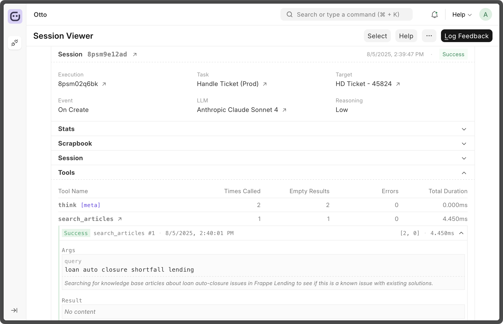

<div align="center" markdown="1">


<h1>Otto</h1>

**Automation intelligence for the Frappe ecosystem**

<div>
    <picture>
        
    </picture>
</div>

</div>

> [!WARNING]
>
> Otto is in very early stages of development, the application aspects of it are
> still under heavy experimentation.
>
> Nevertheless, you may use it as library in your own Frappe app to manage interaction
> with LLMs.
>
> [Library documentation](./otto/lib/docs/README.md) for reference.

### Overview

Otto is a [Frappe Framework](https://github.com/frappe/frappe) app which will be
used for adding intelligent automation capabilities to Frappe apps. It's still a
work in progress that's being tested out internally.

Otto's app features are built on top of it's library. You may use this in your
Frappe app to handle LLM integrations. ([Docs](./otto/lib/docs/README.md))

### Library Examples

Brief example of how the library can be used. Link to [full library docs](./otto/lib/docs/README.md) for more details.

```python
import otto.lib as otto
from otto.lib.types import ToolUseUpdate


# 1. Fetch model matching some criteria
model = otto.get_model(supports_vision=True, size="Small", provider="OpenAI") # str model id


# 2. Create new session
session = otto.new(
    model=model,
    instruction="You are a helpful coding assistant",
    tools=[calculator_tool_schema],
)

# Save id to resume session later
session_id = session.id


# 3. Interact (streaming)
stream = session.interact("Calculate 15 * 23", stream=True)
for chunk in stream:
    print(chunk.get("text", ""), end="")
result = stream.item


# 4. Handle tool use
for tool in session.get_pending_tool_use():
    result = execute_tool(tool.name, tool.args) # execute tool

    # update session with tool result
    session.update_tool_use(
        ToolUseUpdate(id=tool.id, status="success", result=result)
    )

# Continue session with tool result
session.interact(stream=False)


# 5. Load and resume interaction (non-streaming)
session = otto.load(session_id)
response, _ = session.interact("What was the result?", stream=False)
if response:
    print(response["content"])
```

### Local Installation

You can install this app using the [bench](https://github.com/frappe/bench) CLI, first setup a Frappe bench directory and create a new site then:

```bash
# In you bench directory
bench get-app otto --branch develop
bench --site site-name install-app otto
```

## Links

- [Otto Lib Docs](./otto/lib/docs/README.md)

<br>
<br>
<div align="center">
	<a href="https://frappe.io" target="_blank">
		<picture>
			<source media="(prefers-color-scheme: dark)" srcset="https://frappe.io/files/Frappe-white.png">
			
		</picture>
	</a>
</div>
